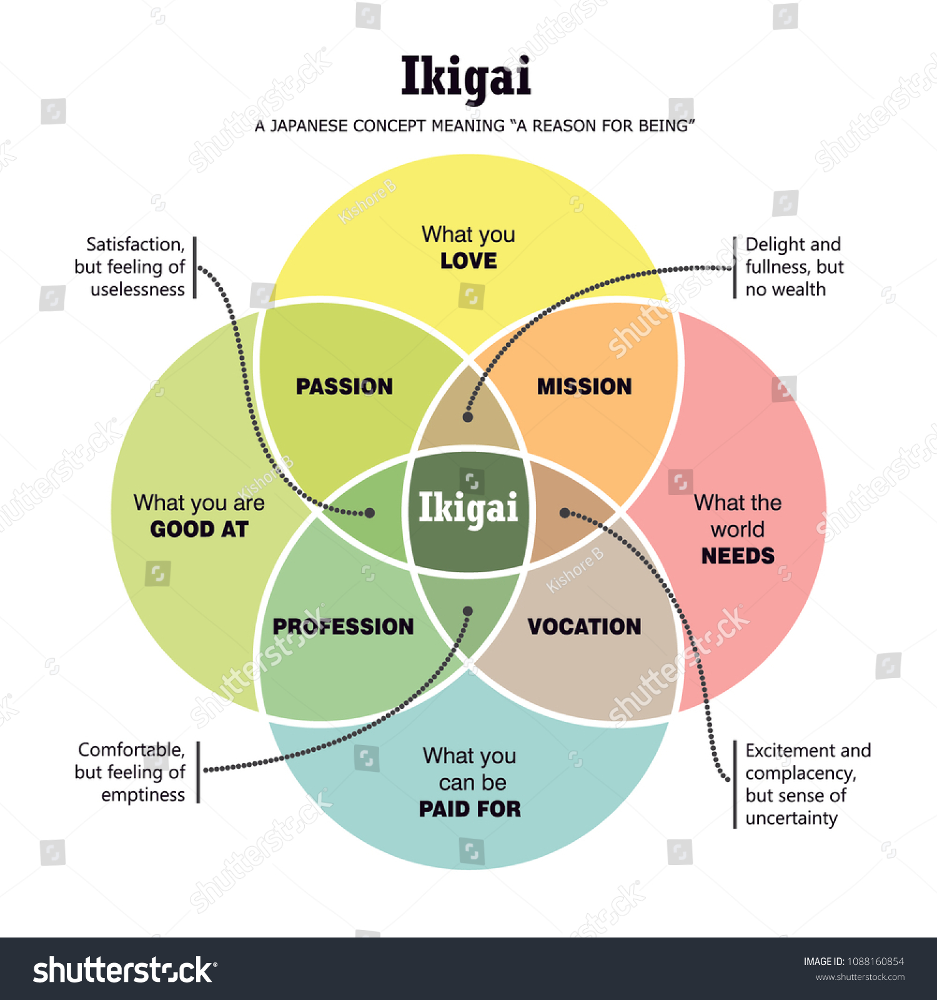

# Ikigai Zone

The Ikigai Zone is a project that aims to bring humanity and purpose back to knowledge work.

## What is Ikigai ?

> **Ikigai** (生き甲斐,) is a Japanese term for "a reason for being." The word ‘Ikigai’ usually refers to the source of value in one's life or the things that make one's life worthwhile. The word roughly translates to the "thing that you live for" but it also has the nuance of "the reason for which you wake up in the morning" similar to a daily purpose. Each individual's ikigai is personal to them and specific to their lives, values and beliefs. It reflects the inner self of an individual and expresses that faithfully, while simultaneously creating a mental state in which the individual feels at ease. Activities that allow one to feel ikigai are never forced on an individual; they are often spontaneous, and always undertaken willingly, giving the individual satisfaction and a sense of meaning to life.

(Source: [wikipedia](https://en.wikipedia.org/wiki/Ikigai))
